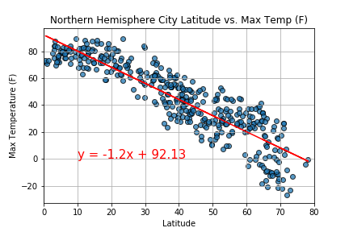
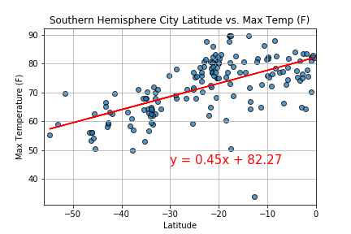
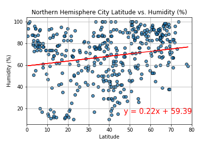
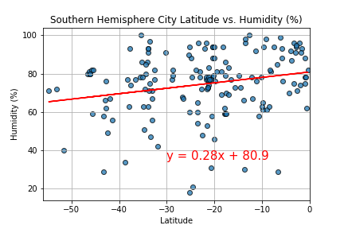
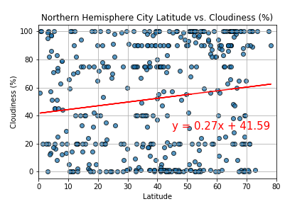
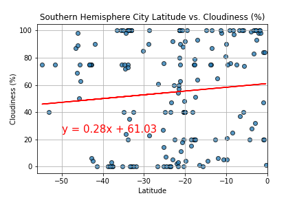
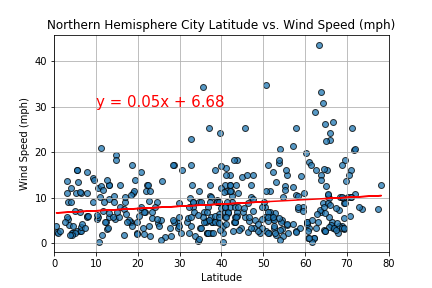
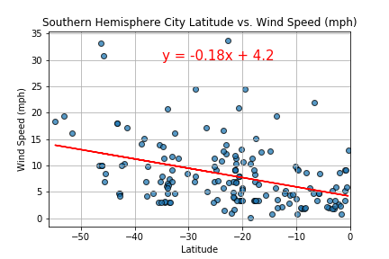

# Python API Challenge - What's the Weather Like? #

## Background ##

Whether financial, political, or social -- data's true power lies in its ability to answer questions definitively. So let's take what you've learned about Python requests, APIs, and JSON traversals to answer a fundamental question: "What's the weather like as we approach the equator?"

Now, we know what you may be thinking: "Duh. It gets hotter..."

But, if pressed, how would you prove it?

## Observations/Analysis ##

### Latitude vs. Max Temperature ###

The two plots above show the relationship between latitude and max temperatures for cities in the Northern Hemisphere compared to cities in the Southern Hemisphere. For cities in the Northern Hemisphere, the max temperature decreases with latitude, indicating that the further a city is from the equator, the lower its max temperature is. For cities in the Southern Hemisphere, the max temperature increases with latitude, indicating that the closer a city is to the equator, the higher its max temperature is. Both graphs show that cities closer to the equator have higher max temperatures than cities further away.

### Latitude vs. Humidity ###

The two plots above show the relationship between a city's humidity and its distance from the equator. For cities in both hemispheres, the humidity increases as latitude increases, indicating that cities further north have higher humidity than cities further south. This does make sense, as in the Northern Hemisphere it's the end of winter, which tends to bring more precipitation. However, the low r-squared values indicate that the relationship between humidity and latitude isn't very strong.

### Latitude vs. Cloudiness ###

The above graphs show the relationship between latitude and cloudiness for cities in both hemispheres. The relationship between cloudiness and latitude is positive in both graphs, indicating that as latitude increases, cloudiness also increases. This does make sense, as in the Northern Hemisphere it's the end of winter, which tends to be more cloudy. However, the low r-squared values indicate that the relationship between cloudiness and latitude isn't very strong.

### Latitude vs. Wind Speed ###

The above graphs show the relationship between latitude and wind speed for cities in both hemispheres. For cities in the Northern Hemisphere, there is a positive relationship between latitude and wind speed, while cities further south have a negative relationship between latitude and wind speed. This indicates that cities closer to the equator have lower wind speeds than cities further away. However, the low r-squared values for both plots indicate that the relationship between latitude and wind speed isn't very strong.
